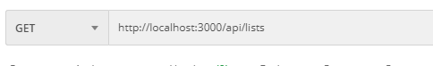
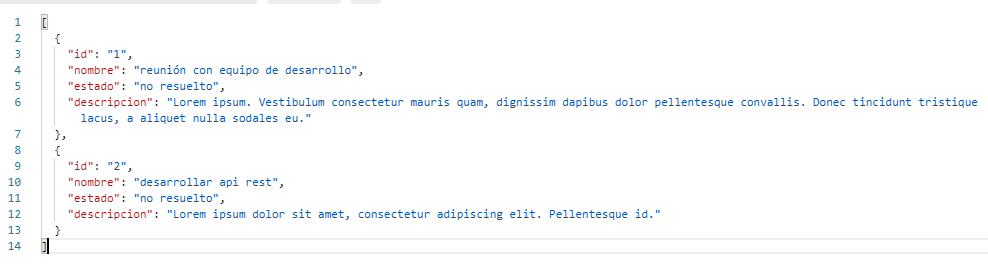
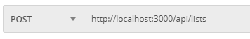
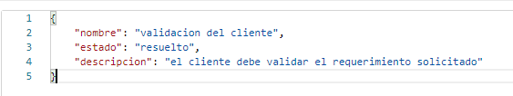
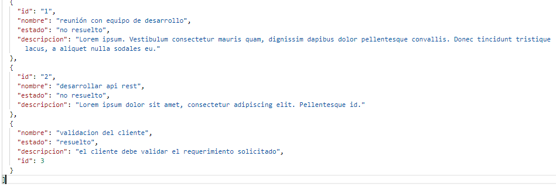
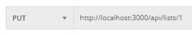
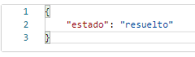
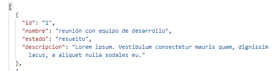
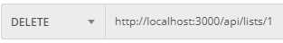
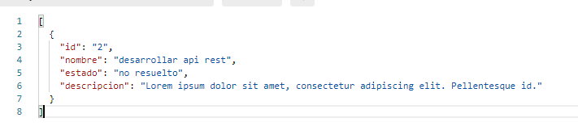

# To do list con nodejs
Ejecutar `npm run dev`

Desarrollo de API Rest para un sistema "TO DO List" con las siguientes funcionalidades:

* Obtener listado de tareas y su estado
* Agregar tarea
* Marcar tarea como resuelta

Los datos de las tareas son:

* Nombre
* Estado (No Resuelto / Resuelto)
* Descripción

Hints: Apropiado uso de los frameworks, documentación y calidad del código.

## Pasos

1. Iniciamos el proyecto con `npm init`.

2. Instalamos el framework **express** ya que es el más usado, robusto y flexible para el desarrollo de Api's, y la creación de nuestras rutas: `npm i express --save`.

3. instalamos el middleware **morgan** que nos permite ver por consola las peticiones que van llegando: `npm i morgan`.

4. Instalamos el modulo **nodemon** para que el servidor se actualice automaticamente en cada cambio del proyecto, donde -D significa que se podra ejecutar como dependencia de desarrollo, mas no cuando esté en produccion: `npm i nodemon -D`. 
Después de la instalacion, debemos configurar el archivo `package.json`, agregando en script la siguiente linea: `"dev": "nodemon src/index.js"`. Ahora para ejecutar nuestro proyecto se debe ingresar `npm run dev`.

5. Instalamos a libreria **underscore** para poder recorrer un arreglo. `npm i underscore`.

6. Utilizaremos postman para simular las peticiones, pedir estas rutas y obtener la respuesta.

## Resultados en Postman
La ruta principal en que está alojado nuestra api es el `localhost:3000/api/lists`

GET: 
Al solicitar el GET en la api, Postman nos devuelve el contenido de nuestra "DB", contenido en el archivo `sample.json`
 

 

 
 

POST: 
Aquí queremos ingresar una nueva tarea, mediante Postman, donde a continuación se muestra los datos a ingresar:
 

 

 
Después de la petición, se ve reflejado el nuevo objeto ingresado, con id 3.
 

 
 

PUT: 
Para actualizar un objeto, se debe especificar el id, como en este ejemplo es el id 1.
 

 
Aquí vemos el valor a actualizar, el estado.
 

 
Ahora vemos que la actualización fue realizada con éxito.
 

 
 

DELETE: 
Para eliminar un objeto, se debe especificar el id, como en este ejemplo es el id 1.
 

 
Como vemos a continuación, el objeto con id 1 fue eliminado exitosamente.
 

 
 
